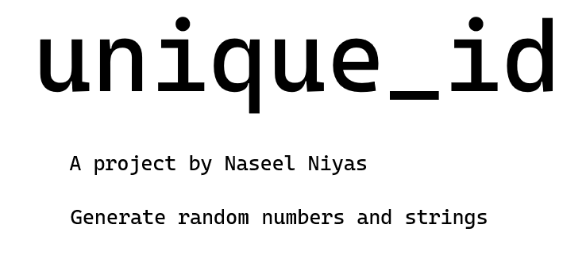

[![Contributors][contributors-shield]][contributors-url]
[![Forks][forks-shield]][forks-url]
[![Stargazers][stars-shield]][stars-url]
[![Issues][issues-shield]][issues-url]


<!-- PROJECT LOGO -->
<br />
<p align="center">

  <a href="https://github.com/NaseelNiyas/unique_id">
   
  </a>

  <h3 align="center">unique_id</h3>

  <p align="center">
    Generate random numbers and strings!
    <br />
    <a href="https://github.com/NaseelNiyas/unique_id"><strong>Docs »</strong></a>
    <br />
    <br />
    <a href="https://github.com/NaseelNiyas/unique_id/issues">Report Bug</a>
    ·
    <a href="https://github.com/NaseelNiyas/unique_id/issues">Request Feature</a>
  </p>
</p>


## Installation
#### With npm
```bash
npm install --save @naseelniyas/unique_id
```
#### With yarn
```bash
yarn add @naseelniyas/unique_id
```

## Usage & Examples
#### Generating a random integer between below 500(cann be any number of course):
```javascript
const unique = require('@naseelniyas/unique_id');

//Change the number for a different max value
const num = unique.uniqueInt(500);

console.log(num)
```
#### Generate a random string (useful for uuids)
```javascript
const unique = require('@naseelniyas/unique_id');

const str = unique.uniqueString()

console.log(str)
```
#### Random from an array
```javascript
const unique = require('@naseelniyas/unique_id');
//Sample array with sample data
const arr = ['unique', 'string', 'array', 'javascript is awesome'];

const uniqueValue = unique.uniqueFromArray(arr);

console.log(uniqueValue);
```
#### Decimal between 0 and one
```javascript
const unique = require('@naseelniyas/unique_id');

const num = unique.zeroToOne();

console.log(num);
```

## Contribution: 
### If you wanted to contribute to this project you can do so! Just create an issue on GitHub!
Repository Url: [https://github.com/NaseelNiyas/unique_id](https://github.com/NaseelNiyas/unique_id)

### **If you found this package helpful, then why not star ⭐🌟  the project, It would be helpful**
<center>
Naseel Niyas from techharvesting 

</center>


<!-- MARKDOWN LINKS & IMAGES -->
<!-- https://www.markdownguide.org/basic-syntax/#reference-style-links -->
[contributors-shield]: https://img.shields.io/github/contributors/NaseelNiyas/unique_id.svg?style=for-the-badge
[contributors-url]: https://github.com/NaseelNiyas/unique_id/graphs/contributors
[forks-shield]: https://img.shields.io/github/forks/NaseelNiyas/unique_id.svg?style=for-the-badge
[forks-url]: https://github.com/NaseelNiyas/unique_id/network/members
[stars-shield]: https://img.shields.io/github/stars/NaseelNiyas/unique_id.svg?style=for-the-badge
[stars-url]: https://github.com/NaseelNiyas/unique_id/stargazers
[issues-shield]: https://img.shields.io/github/issues/NaseelNiyas/unique_id.svg?style=for-the-badge
[issues-url]: https://github.com/NaseelNiyas/unique_id/issues
[license-shield]: https://img.shields.io/github/license/NaseelNiyas/unique_id.svg?style=for-the-badge
[linkedin-shield]: https://img.shields.io/badge/-LinkedIn-black.svg?style=for-the-badge&logo=linkedin&colorB=555
[product-screenshot]: images/screenshot.png